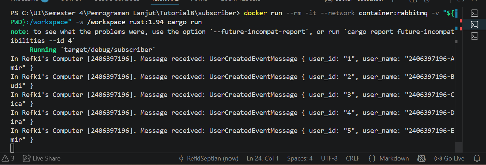

# Module 9 - Subscriber

## Apa itu AMQP?

AMQP adalah singkatan dari Advanced Message Queuing Protocol. AMQP adalah protokol yang digunakan untuk mengirim pesan antar aplikasi melalui message broker.

Pada tutorial ini, AMQP digunakan agar publisher bisa mengirim event ke RabbitMQ, lalu subscriber bisa menerima dan memproses event tersebut.

## Apa arti `guest:guest@localhost:5672`?

`guest` yang pertama adalah username untuk masuk ke RabbitMQ.

`guest` yang kedua adalah password untuk masuk ke RabbitMQ.

`localhost` berarti RabbitMQ berjalan di komputer kita sendiri.

`5672` adalah port yang digunakan RabbitMQ untuk komunikasi AMQP.

## Screenshot subscriber-received-message
Berikut adalah hasil ketika publisher mengirim 5 event ke RabbitMQ, lalu subscriber menerima dan memproses event tersebut.

Pada percobaan ini, publisher mengirim 5 event `UserCreatedEventMessage`. Setiap event masuk ke RabbitMQ terlebih dahulu sebagai message broker, lalu diterima oleh subscriber melalui queue `user_created`.

Hasil pada terminal menunjukkan bahwa subscriber berhasil menerima 5 message, yaitu user dengan id 1 sampai 5. Ini menunjukkan bahwa komunikasi event-driven berjalan dengan benar: publisher tidak mengirim data langsung ke subscriber, tetapi melalui RabbitMQ.