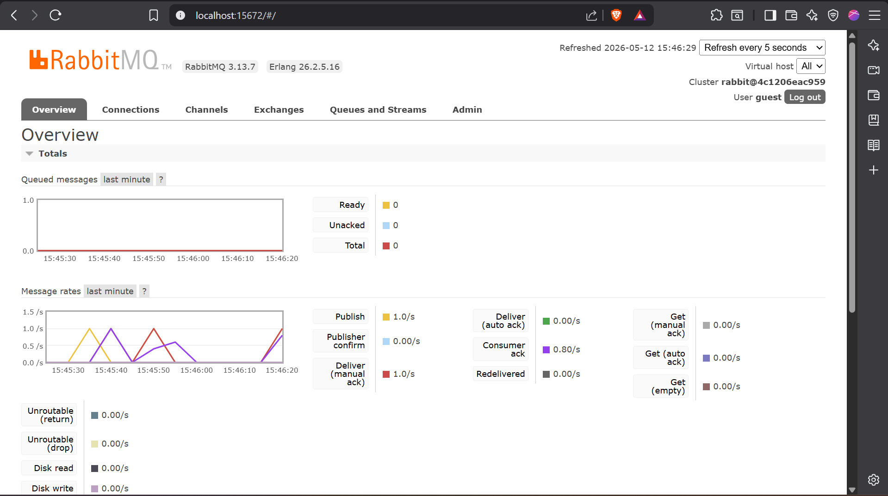
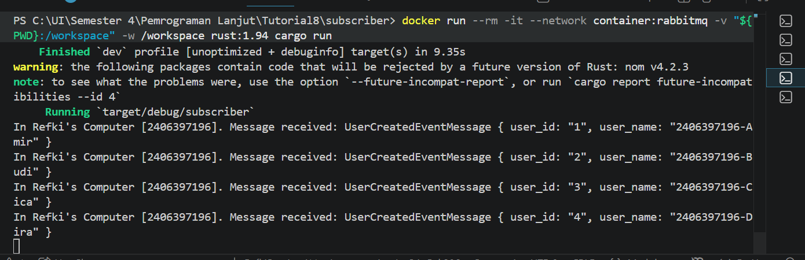
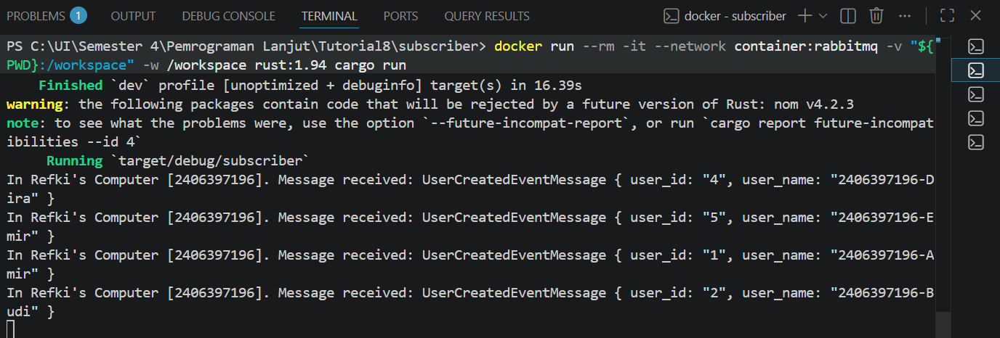
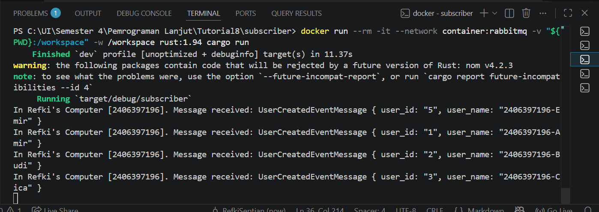

# Module 9 - Subscriber

## Apa itu AMQP?

AMQP adalah singkatan dari Advanced Message Queuing Protocol. AMQP adalah protokol yang digunakan untuk mengirim pesan antar aplikasi melalui message broker.

Pada tutorial ini, AMQP digunakan agar publisher bisa mengirim event ke RabbitMQ, lalu subscriber bisa menerima dan memproses event tersebut.

## Apa arti `guest:guest@localhost:5672`?

`guest` yang pertama adalah username untuk masuk ke RabbitMQ.

`guest` yang kedua adalah password untuk masuk ke RabbitMQ.

`localhost` berarti RabbitMQ berjalan di komputer kita sendiri.

`5672` adalah port yang digunakan RabbitMQ untuk komunikasi AMQP.

## Screenshot subscriber-received-message
Berikut adalah hasil ketika publisher mengirim 5 event ke RabbitMQ, lalu subscriber menerima dan memproses event tersebut.

Pada percobaan ini, publisher mengirim 5 event `UserCreatedEventMessage`. Setiap event masuk ke RabbitMQ terlebih dahulu sebagai message broker, lalu diterima oleh subscriber melalui queue `user_created`.

Hasil pada terminal menunjukkan bahwa subscriber berhasil menerima 5 message, yaitu user dengan id 1 sampai 5. Ini menunjukkan bahwa komunikasi event-driven berjalan dengan benar: publisher tidak mengirim data langsung ke subscriber, tetapi melalui RabbitMQ.

## Simulating slow subscriber

Berikut adalah screenshot RabbitMQ ketika subscriber dibuat lambat dengan menambahkan `thread::sleep(ten_millis);`.

Pada percobaan ini, subscriber dibuat memproses setiap message dengan delay 1 detik. Sementara itu, publisher dijalankan beberapa kali secara cepat. Karena publisher dapat mengirim message lebih cepat daripada subscriber memprosesnya, message akan menumpuk sementara di queue RabbitMQ.

Jumlah queue dapat naik karena RabbitMQ menyimpan message yang belum sempat diproses oleh subscriber. Setelah subscriber terus berjalan, queue akan turun sedikit demi sedikit karena message diproses satu per satu.

## Reflection and Running at least three subscribers

Berikut adalah hasil ketika tiga subscriber dijalankan secara bersamaan.

Pada percobaan ini, saya menjalankan tiga subscriber yang terhubung ke queue yang sama, yaitu `user_created`. Setelah publisher dijalankan beberapa kali, message tidak hanya diproses oleh satu subscriber, tetapi dibagi ke beberapa subscriber.

Hal ini terjadi karena RabbitMQ mendistribusikan message ke consumer yang sedang aktif pada queue tersebut. Dengan tiga subscriber, proses konsumsi message menjadi lebih cepat dibanding hanya satu subscriber, karena beban pemrosesan dibagi ke beberapa proses.

Menurut saya, kode publisher dan subscriber masih bisa diperbaiki. Pertama, bagian `loop {}` pada subscriber kurang ideal karena membuat program berjalan terus tanpa mekanisme shutdown yang rapi. Kedua, error handling masih terlalu sederhana karena banyak bagian menggunakan `unwrap()`. Jika koneksi ke RabbitMQ gagal, program langsung berhenti. Ketiga, konfigurasi seperti URL RabbitMQ sebaiknya dipindahkan ke environment variable agar lebih fleksibel dan tidak hardcoded di dalam kode.